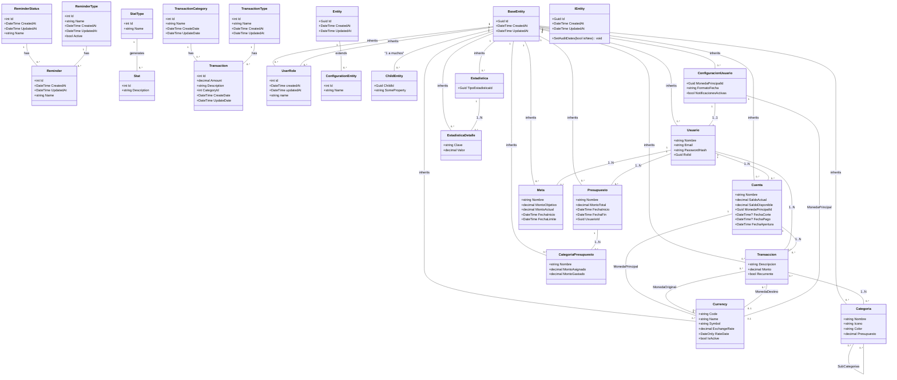

```mermaid
classDiagram
    class ReminderStatus {
        +int Id
        +DateTime CreatedAt
        +DateTime UpdatedAt
        +string Name
    }
    class Reminder {
        +int Id
        +DateTime CreatedAt
        +DateTime UpdatedAt
        +string Name
    }
    ReminderStatus "1" -- "0..*" Reminder : has

    class ReminderType {
        +int Id
        +string Name
        +DateTime CreatedAt
        +DateTime UpdatedAt
        +bool Active
    }
    ReminderType "1" -- "0..*" Reminder : has

    class StatType {
        +int Id
        +string Name
    }
    class Stat {
        +int Id
        +string Description
    }
    StatType "1" -- "0..*" Stat : generates

    class TransactionCategory {
        +int Id
        +string Name
        +DateTime CreateDate
        +DateTime UpdateDate
    }
    class Transaction {
        +int Id
        +decimal Amount
        +string Description
        +int CategoryId
        +DateTime CreateDate
        +DateTime UpdateDate
    }
    TransactionCategory "1" -- "0..*" Transaction : has

    class TransactionType {
        +int Id
        +string Name
        +DateTime CreatedAt
        +DateTime UpdatedAt
    }
    TransactionType "1" -- "0..*" Transaction : has

    class UserRole {
        +int id
        +DateTime createdAt
        +DateTime updatedAt
        +string name
    }
    class BaseEntity {
        +Guid Id
        +DateTime CreatedAt
        +DateTime UpdatedAt
    }
    BaseEntity "1" -- "0..*" UserRole : inherits

    class Entity {
        +Guid Id
        +DateTime CreatedAt
        +DateTime UpdatedAt
    }
    class ConfigurationEntity {
        +int Id
        +string Name
    }
    Entity "1" -- "0..*" ConfigurationEntity : extends

    class IEntity {
        +Guid Id
        +DateTime CreatedAt
        +DateTime UpdatedAt
        +SetAuditDates(bool isNew) void
    }

    class ChildEntity {
        +Guid ChildId
        +string SomeProperty
    }
    BaseEntity "1" -- "0..*" ChildEntity : "1 a muchos"

    class Usuario {
        +string Nombre
        +string Email
        +string PasswordHash
        +Guid RolId
    }

    class Cuenta {
        +string Nombre
        +decimal SaldoActual
        +decimal SaldoDisponible
        +Guid MonedaPrincipalId
        +DateTime? FechaCorte
        +DateTime? FechaPago
        +DateTime FechaApertura
    }

    class Presupuesto {
        +string Nombre
        +decimal MontoTotal
        +DateTime FechaInicio
        +DateTime FechaFin
        +Guid UsuarioId
    }

    class Transaccion {
        +string Descripcion
        +decimal Monto
        +bool Recurrente
    }

    class Currency {
        +string Code
        +string Name
        +string Symbol
        +decimal ExchangeRate
        +DateOnly RateDate
        +bool IsActive
    }

    class Categoria {
        +string Nombre
        +string Icono
        +string Color
        +decimal Presupuesto
    }

    class CategoriaPresupuesto {
        +string Nombre
        +decimal MontoAsignado
        +decimal MontoGastado
    }

    class Meta {
        +string Nombre
        +decimal MontoObjetivo
        +decimal MontoActual
        +DateTime FechaInicio
        +DateTime FechaLimite
    }

    class Estadistica {
        +Guid TipoEstadisticaId
    }

    class EstadisticaDetalle {
        +string Clave
        +decimal Valor
    }

    class ConfiguracionUsuario {
        +Guid MonedaPrincipalId
        +string FormatoFecha
        +bool NotificacionesActivas
    }

    BaseEntity "1" -- "0..*" Usuario : inherits
    BaseEntity "1" -- "0..*" Cuenta : inherits
    BaseEntity "1" -- "0..*" Presupuesto : inherits
    BaseEntity "1" -- "0..*" Transaccion : inherits
    BaseEntity "1" -- "0..*" UserRole : inherits
    BaseEntity "1" -- "0..*" Currency : inherits
    BaseEntity "1" -- "0..*" Categoria : inherits
    BaseEntity "1" -- "0..*" CategoriaPresupuesto : inherits
    BaseEntity "1" -- "0..*" Meta : inherits
    BaseEntity "1" -- "0..*" Estadistica : inherits
    BaseEntity "1" -- "0..*" EstadisticaDetalle : inherits
    BaseEntity "1" -- "0..*" ConfiguracionUsuario : inherits

    Usuario "1" -- "0..*" Cuenta : 1..N
    Usuario "1" -- "0..*" Presupuesto : 1..N
    Usuario "1" -- "0..*" Transaccion : 1..N
    Usuario "1" -- "0..*" Meta : 1..N

    Cuenta "1" -- "0..*" Transaccion : 1..N
    Cuenta "1" -- "0..1" Currency : MonedaPrincipal

    Transaccion "0..*" -- "0..1" Currency : MonedaOriginal
    Transaccion "0..*" -- "0..1" Currency : MonedaDestino
    Transaccion "0..*" -- "0..*" Categoria : 1..N

    Categoria "0..*" -- "0..*" Categoria : SubCategorias

    Presupuesto "1" -- "0..*" CategoriaPresupuesto : 1..N

    Estadistica "1" -- "0..*" EstadisticaDetalle : 1..N

    ConfiguracionUsuario "1" -- "1" Usuario : 1..1
    ConfiguracionUsuario "1" -- "0..1" Currency : MonedaPrincipal
```